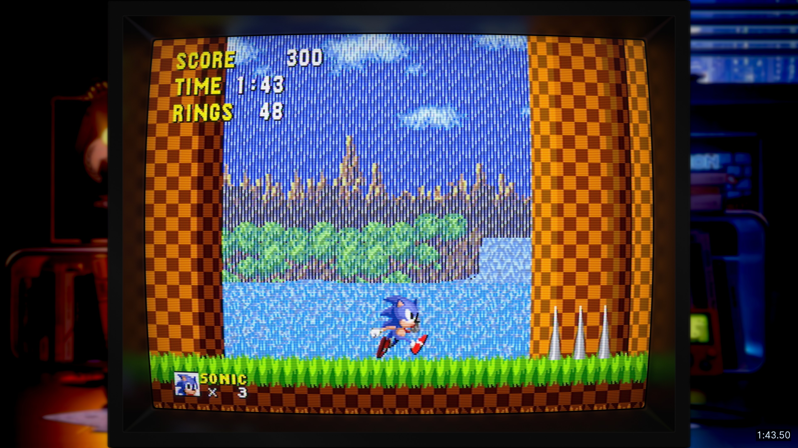
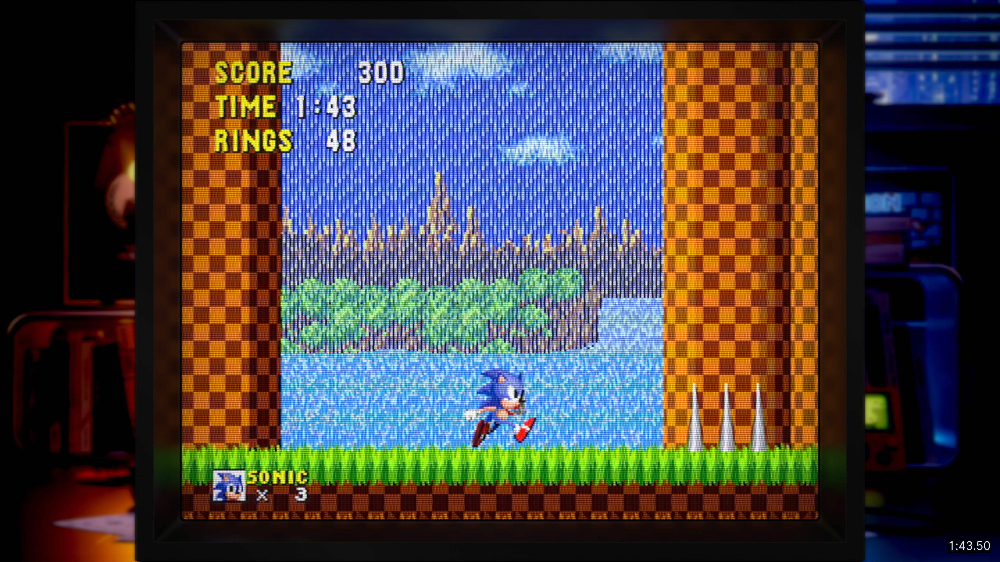
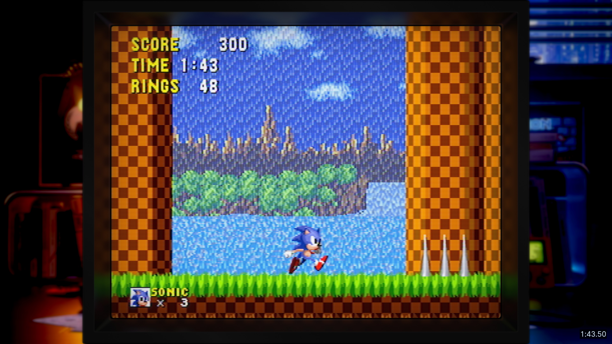
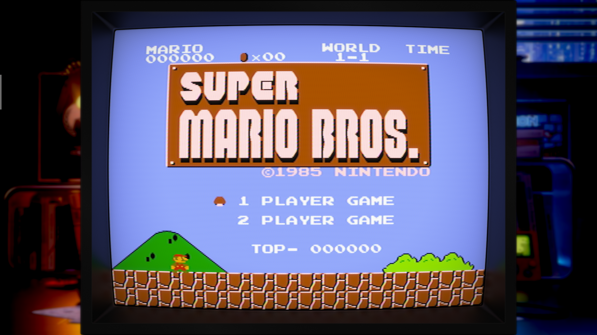
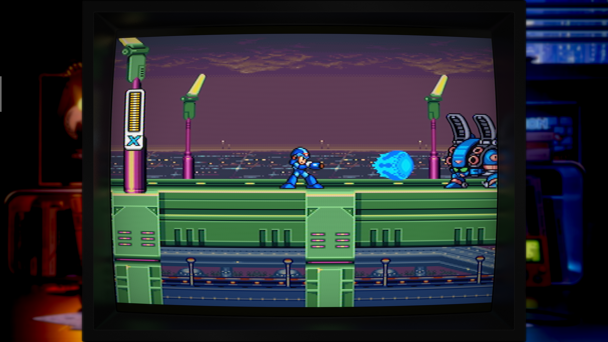
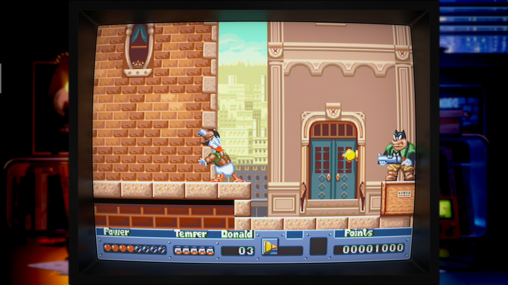
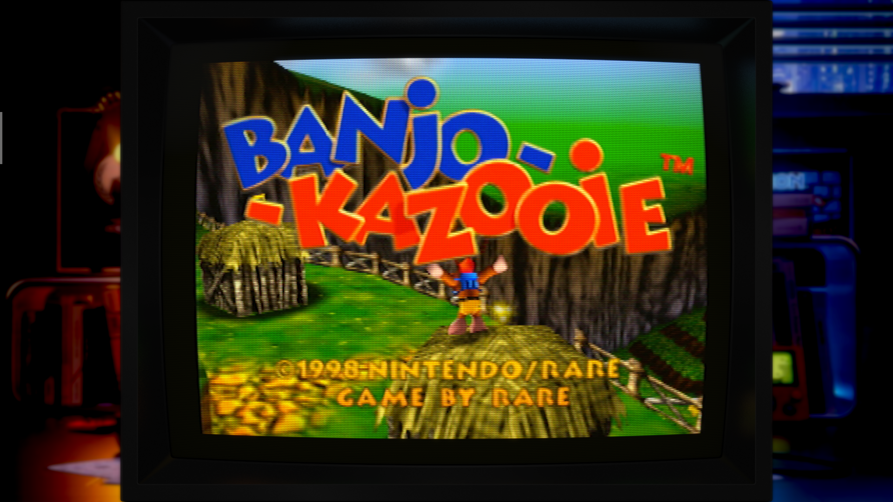

# WolfHedron-CRT-Mega-Bezel-Shader-Preset

## IMPORTANT INFO BEFORE YOU DOWNLOAD!

### 1 - THIS SHADER PRESET MAY NOT RUN WELL ON WEAKER OR OLDER HARDWARE, I HAVEN'T PERSONALLY TESTED.

### 2 - USING DIFFERENT CORES, THAN WHAT MY SCREENSHOT CAPTIONS SAY. MAY RESULT IN DIFFERENT COLORS IN GAMES. SINCE CORE SETTINGS CAN HAVE DIFFERENT CHOICES FOR COLOR PALETTES.

## Description
* This is a Mega Bezel Shader Preset I made for myself, to use with RetroArch. For games you would have played on a CRT TV from the 90s.
* Technacally it's a hybrid of a TV, and a Commador 64 monitor. I actually played a lot of my systems on a C64 monitor back then, due to the sharper and more colorful image.
* The Mega Bezel Shader comes pre-installed with RetroArch, if it is not for some reason, you can get it from here - https://github.com/HyperspaceMadness/Mega_Bezel
* I made this preset from looking at a lot of IRL pictures of TVs. In order to get it close to how I used to play these old games back then, in my bedroom at night.
* View the screenshots below to see examples, and what other types of presets are included.

## What the ZIP includes
* Readme Text File Instructions, In Each Folder
* Shader Preset Files
* Overlay Image (used in screenshots below), And It's Config File 

## No Dither Smoothing & Dither Smoothing Presets

- No Dither Smoothing

- Dither Smoothing

## Flat Screen CRT Presets

- Flat Screen - No Dither Smoothing

- Flat Screen - Dither Smoothing

## Example Screenshots

- Super Mario Bros. - Nintendo - (Mesen Core)

- Mega Man X - Super Nintendo - (Mesen-S Core)

- QuackShot - Sega Genesis - (PicoDrive Core)

- Banjo Kazooie - Nintendo 64 - (Mupen64Plus-Next Core)

- Crash Bandicoot - Playstation - (Beetle PSX Core)
